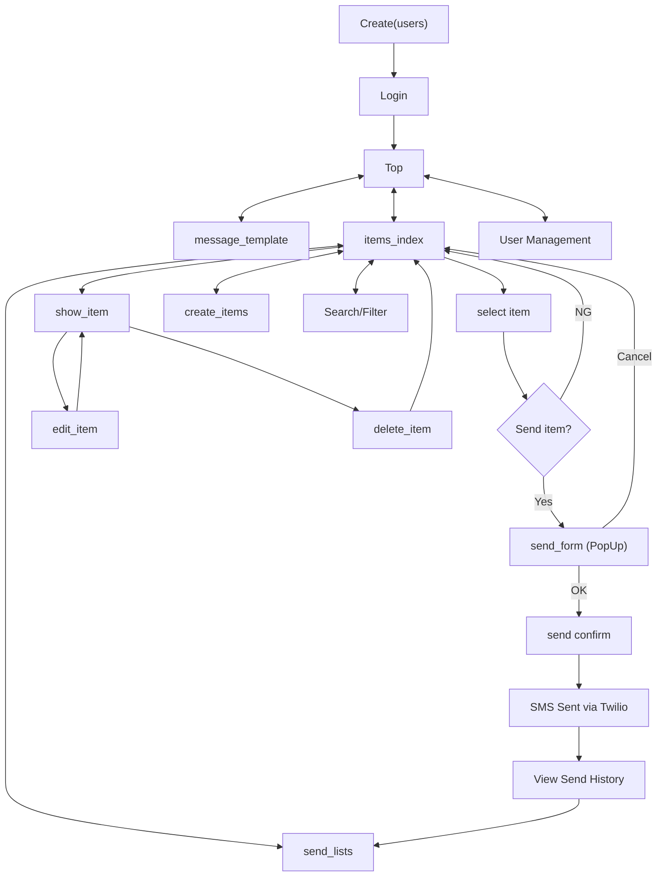
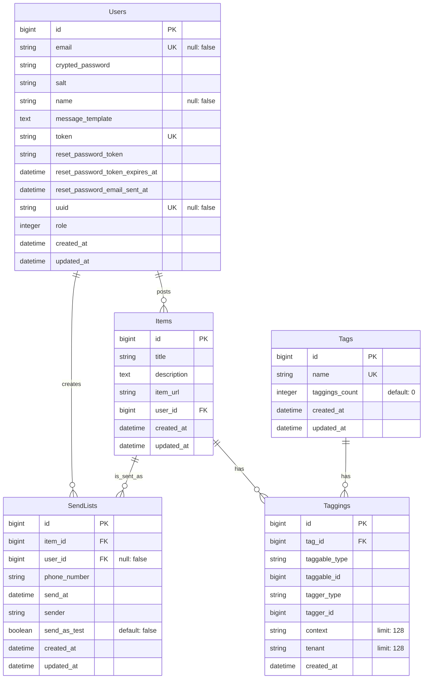

# Emergency Call Support

Emergency Call Supportは、119番通報時の指令員（オペレーター）の業務を支援し、通報者への指導をより効果的に行うためのWebアプリケーションです。

🌟 [アプリページ](https://ecs-4.fly.dev/)

## サービス概要

- 事前に準備された説明動画をSMSで送信
- 通報者の理解度向上と迅速な対応をサポート
- 指令員の業務効率化を実現

## 主な機能

- 状況別の説明動画ライブラリ
- ワンクリックでのSMS送信機能
- 送信履歴の管理
- 検索・フィルタリング機能
- ユーザー管理システム

## 画面遷移図

システムの画面遷移は以下通りです：

[詳細画面遷移図（Figma）](https://www.figma.com/file/b2eg08fgpCZsViWha4ok0T/Emergency_Call_Support(Flow-Diagram)?type=whiteboard&node-id=0%3A1&t=87TxCsT2z5kEfRZS-1)

## ER図

システムのデータベース構造を表すER図は以下の通りです：

## 技術スタック

- フロントエンド: HTML, CSS, JavaScript, TailwindCSS
- バックエンド: Ruby on Rails, Node.js
- データベース: PostgreSQL
- インフラ: Docker
- デプロイ: Fly.io
- SMS送信: Twilio API

## 開発背景

現役消防士である開発者が、日々の119番通報対応業務の中で感じた課題を解決するために考案しました。音声のみによる説明での不安や誤解を解消し、より効果的な初期対応を実現することを目指しています。

🧑‍🚒 [開発者X](https://x.com/EmergencyCplus)

📺 [YouTubeチャンネル](https://www.youtube.com/@emegency_cplus "YouTube EmergenCy+")

応急手当て等のショート動画は↑チャンネルから（随時更新予定）

## 導入効果

- 通報者への的確な指示による救命率の向上
- 指令員の負担軽減と対応時間の短縮
- 標準化された指導による均一なサービス提供

## お問い合わせ

Emergency Call Supportの導入やデモンストレーションについてのお問い合わせは、以下のGoogleフォームからお願いいたします。

[お問い合わせフォーム](https://forms.gle/WoPsBfeCWghTMHAh9)
