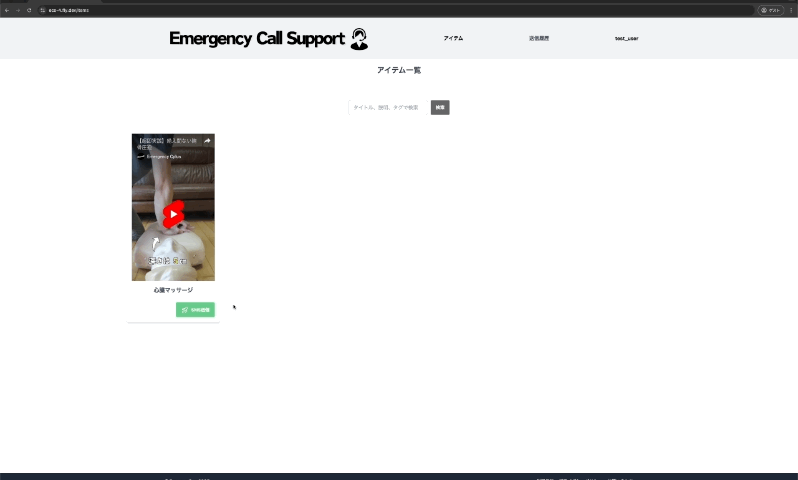

# Emergency Call Support - Version 4

Emergency Call Supportは、119番通報時の指令員（ディスパッチャー）の業務を支援し、
通報者への口頭指導をより効果的に行うためのWebアプリケーションです。

🌟 [アプリページ](https://ecs-4.fly.dev/)

## サービス概要

- 事前に準備された説明動画をSMSで送信
- 通報者の理解度向上と迅速な対応をサポート
- 指令員の業務効率化を実現

## 主な機能

- 状況別の説明動画ライブラリ
- ワンクリックでのSMS送信機能
- 送信履歴の管理
- 検索・フィルタリング機能
- ユーザー管理システム

### 操作画面（スクリーンショット）
|**トップページ**|**ログイン画面**|
|:-:|:-:|
|||
|ヘッダーとボトムナビゲーションを固定 どのページからでもトップページとメインの機能へ|登録したメールアドレスでログイン|

|**アイテム一覧**|**アイテム作成**|
|:-:|:-:|
|||
|**タイトル・タグ**の検索機能により 必要な説明動画をすばやく見つけることが可能|YouTubeにアップロードされているShorts動画をすぐに登録 補足の説明やタグの追記も可能|

|**アイテム詳細**|**SMS送信**|
|:-:|:-:|
|||
|動画をプレビュー確認でき、**誤選択を防止** 必要に応じて編集削除も実行可能|電話番号を入力するだけで **ワンクリックでSMS送信**が完了 送信履歴も自動で記録|

## 導入により想定される効果

- 通報者の理解度向上
- 通報者への的確な指示による救命率の向上
- 指令員の負担軽減と対応時間の短縮
- 標準化された指導による均一なサービス提供

## 詳細ドキュメント

詳細な仕様、設計図、セットアップ手順などは以下のドキュメントを参照してください：

- [システム詳細仕様書](docs/DOCUMENTATION.md)

## 開発背景

119のオペレーター、現役消防士。
音声のみによる説明での不安や誤解を解消し、より効果的な初期対応を実現することを願い開発を進めています。

🧑‍🚒 [開発者X](https://x.com/emergency_cplus)

📺 [YouTubeチャンネル](https://www.youtube.com/@emergency_cplus "YouTube EmergenCy+")

応急手当て等のショート動画は↑チャンネルから（随時更新予定）

## お問い合わせ

Emergency Call Supportの導入やデモンストレーションについてのお問い合わせは、以下のGoogleフォームからお願いいたします。

[お問い合わせフォーム](https://forms.gle/WoPsBfeCWghTMHAh9)
