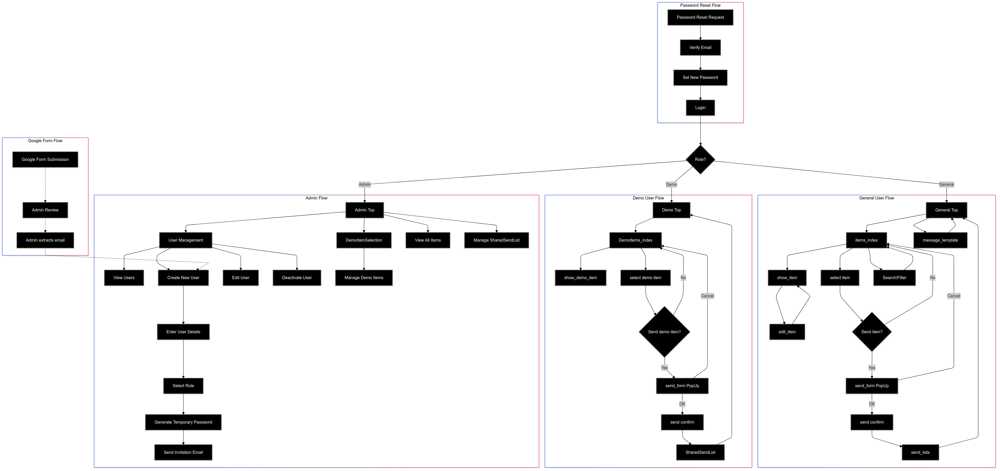
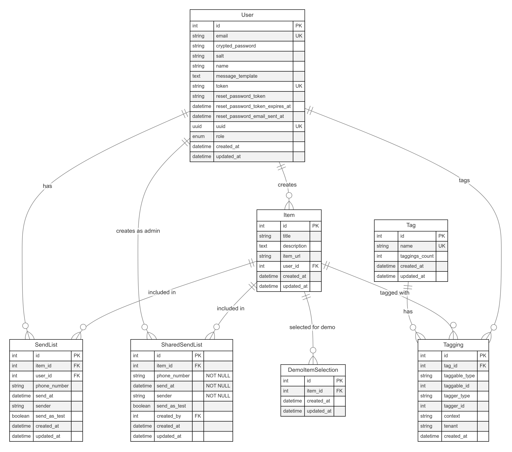

# Emergency Call Support

Emergency Call Supportは、119番通報時の指令員（オペレーター）の業務を支援し、通報者への口頭指導をより効果的に行うためのWebアプリケーションです。

🌟 [アプリページ](https://ecs-4.fly.dev/)

## サービス概要

- 事前に準備された説明動画をSMSで送信
- 通報者の理解度向上と迅速な対応をサポート
- 指令員の業務効率化を実現

## 主な機能

- 状況別の説明動画ライブラリ
- ワンクリックでのSMS送信機能
- 送信履歴の管理
- 検索・フィルタリング機能
- ユーザー管理システム

## 画面遷移図

システムの画面遷移は以下通りです：

[詳細画面遷移図（Figma）](https://www.figma.com/file/b2eg08fgpCZsViWha4ok0T/Emergency_Call_Support(Flow-Diagram)?type=whiteboard&node-id=0%3A1&t=87TxCsT2z5kEfRZS-1)

## ER図

システムのデータベース構造を表すER図は以下の通りです：

## ディレクトリ構造

プロジェクトのディレクトリ構造の詳細は、[DIRECTORY_STRUCTURE.md](DIRECTORY_STRUCTURE.md)を参照してください。

## 技術スタック

- フロントエンド: HTML, CSS, JavaScript, TailwindCSS
- バックエンド: Ruby on Rails, Node.js
- データベース: PostgreSQL
- インフラ: Docker
- デプロイ: Fly.io
- SMS送信: Twilio API

## お問い合わせ

Emergency Call Supportの導入やデモンストレーションについてのお問い合わせは、以下のGoogleフォームからお願いいたします。

[お問い合わせフォーム](https://forms.gle/WoPsBfeCWghTMHAh9)
